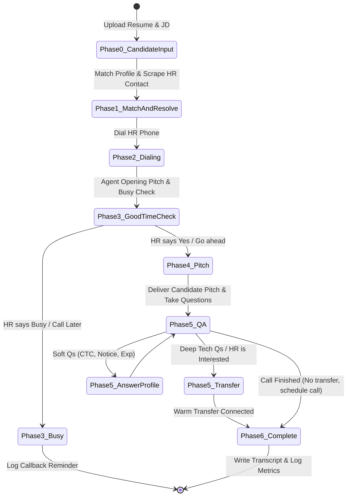

# AI Voice HR Representative Agent Implementation Plan

This project implements an AI Voice Agent that acts as a professional representative of a job candidate. The agent calls HR, pitches the candidate's profile, answers screening questions based on the candidate's resume/JD fit, and can warm-transfer the call to the candidate's phone if HR is interested.

The system utilizes an **Adapter Pattern** to ensure swappability of LLMs, TTS/STT, and Telephony systems without altering core business logic, preventing vendor lock-in and allowing free/cheap fallback options.

---

## User Review Required

> [!IMPORTANT]
> 1. **Vapi.ai vs. Direct Twilio/Telnyx Media Streams**:
>    - For a zero-cost start, Vapi.ai offers $10 free credits (approx. 5 hours of talk-time). Integrating Vapi simplifies STT/TTS orchestration.
>    - If we bypass Vapi for a custom stack (FastAPI WebSockets + Twilio Media Streams + local Whisper/Edge-TTS), it is 100% free (no orchestrator cost) but requires high server processing for local models.
>    - We propose building Vapi as the primary Voice adapter with an option for direct Twilio/Telnyx custom webhooks as the fallback.
> 2. **Call Transfer Infrastructure**:
>    - Warm transfer requires a SIP/PSTN bridge. In Twilio, this is done via `<Dial>` verb; in Vapi, it's done using the `transfer` tool option. The candidate's number must be verified on the carrier to receive calls successfully.
> 3. **Scraper Limitations**:
>    - LinkedIn/Naukri scraping can get rate-limited. We propose using BeautifulSoup/Playwright for direct JD links and a fallback to manual copy-paste of JDs.
> 4. **Three-Tiered Security Integration Options**:
>    - **Phone Number Whitelisting**: Should we restrict outbound dial/transfer destinations only to the candidate's verified number in the database, rejecting external dial requests dynamically to prevent premium phone fraud? *(Recommended: Yes, strict whitelist + DB lookup).*
>    - **Contract/Salary Agreement Boundary**: Should the agent refuse to negotiate or accept contract terms (e.g. salary numbers, start dates), and instead defer all such alignments to the candidate? *(Recommended: Yes, strict refusal prompt + regex output validation).*
>    - **Security Policy Logs Table**: Should we create a dedicated table to audit and monitor user/HR inputs flagging potential prompt injections or security violations? *(Recommended: Yes, log to `security_logs` for analysis/dashboard visualization).*

---

## Technical Architecture

The architecture consists of the following swappable adapters defined in `config.yaml`:

```mermaid
graph TD
    Dashboard[Candidate Web UI] --> FastAPI[FastAPI Core Server]
    FastAPI --> DB[(SQLite/JSON Store)]
    FastAPI --> Scraper[JD & HR Contact Scraper]
    
    FastAPI --> CallOrchestrator[Core Call State Machine]
    
    CallOrchestrator --> Config[config.yaml]
    CallOrchestrator --> LLMAdapter[LLM Adapter Interface]
    CallOrchestrator --> VoiceAdapter[Voice Adapter Interface]
    CallOrchestrator --> TelephonyAdapter[Telephony Adapter Interface]
    
    LLMAdapter --> OpenRouter[OpenRouter / Gemini / Kimi / Claude]
    VoiceAdapter --> Deepgram[Deepgram STT]
    VoiceAdapter --> Whisper[Local Whisper STT]
    VoiceAdapter --> ElevenLabs[ElevenLabs TTS]
    VoiceAdapter --> EdgeTTS[Local/Edge TTS]
    
    TelephonyAdapter --> Vapi[VAPI Orchestrator]
    TelephonyAdapter --> Twilio[Twilio SIP / Outbound]
    TelephonyAdapter --> Telnyx[Telnyx SIP / Outbound]

    Vapi --> HRPhone[HR Phone Line]
    Twilio --> HRPhone
    
    HRPhone -- Bridge / Transfer -- > CandidatePhone[Candidate Phone Line]
```

---

## Proposed Component Layout

We will layout the code as a self-contained Python project with a FastAPI backend and a clean HTML/JS dashboard:

### 1. Configuration & Storage
- `config.yaml`: Configurations, API keys, fallback routes.
- `database.db`: SQLite database storing Candidate Profiles, Scraped JDs, Call Logs with Transcripts, and **Security Policy Logs**.

### 2. Core Service Abstractions
- `adapters/base.py`: Interface contracts for LLM, Voice, and Telephony services.
- `adapters/llm_adapter.py`: Concrete implementations for Anthropic, OpenAI, OpenRouter (Kimi/Llama).
- `adapters/voice_adapter.py`: Concrete integrations for STT (Deepgram, Whisper) and TTS (ElevenLabs, PlayHT, Edge-TTS).
- `adapters/telephony_adapter.py`: Handles Outbound dialing, Webhook responses, and warm transfers (Twilio, Telnyx, Vapi). Includes target number whitelisting validation.

### 3. Orchestration, Scraping & Security
- `core/state_machine.py`: Manages Phase 0 through Phase 6 call flows, integrating security system prompts and output guardrails.
- `core/security.py` [NEW]: Contains zero-trust input scanners, regex-based output filters, and whitelisting logic.
- `core/scraper.py`: Extracts Job Descriptions and resolves HR emails/phones via BeautifulSoup/Apify API.
- `core/pdf_parser.py`: Extracts skills, experience, and metadata from resume PDFs using PyMuPDF.

### 4. API & User Interface
- `main.py`: FastAPI server running local ports, handling REST APIs, static files, and Webhooks.
- `static/index.html`: Dashboard to upload resume, paste JD, track call status, schedule reminders, and read transcripts.
- `static/app.js`: Main frontend logic.
- `static/style.css`: Clean, glassmorphic layout.

---

## Detailed Call Flow & State Machine



---

## Verification Plan

### Automated Verification
- Run tests mock API calls to OpenRouter, ElevenLabs, and Twilio/Vapi:
  ```bash
  python -m pytest tests/
  ```
- Local validation of parsing/scraping logic:
  ```bash
  python core/pdf_parser.py --test-resume resume.pdf
  python core/scraper.py --test-url "https://job-link.com"
  ```

### Manual Verification
- Deploying the FastAPI local server, using Vapi Sandbox/Twilio Test Credentials to initiate an outbound call to a designated testing phone number, verifying:
  1. The opening introduction text matches the candidate's resume/JD.
  2. Fallback to ElevenLabs -> PlayHT works if the primary API key is revoked.
  3. Initiating warm transfer triggers call to the candidate's verification phone number.
